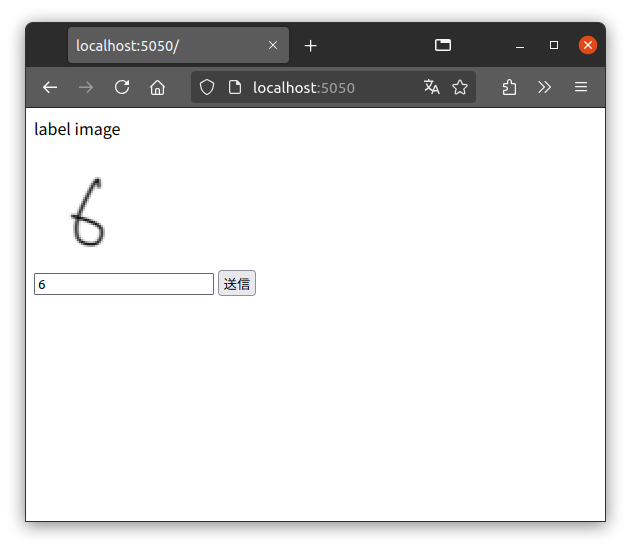
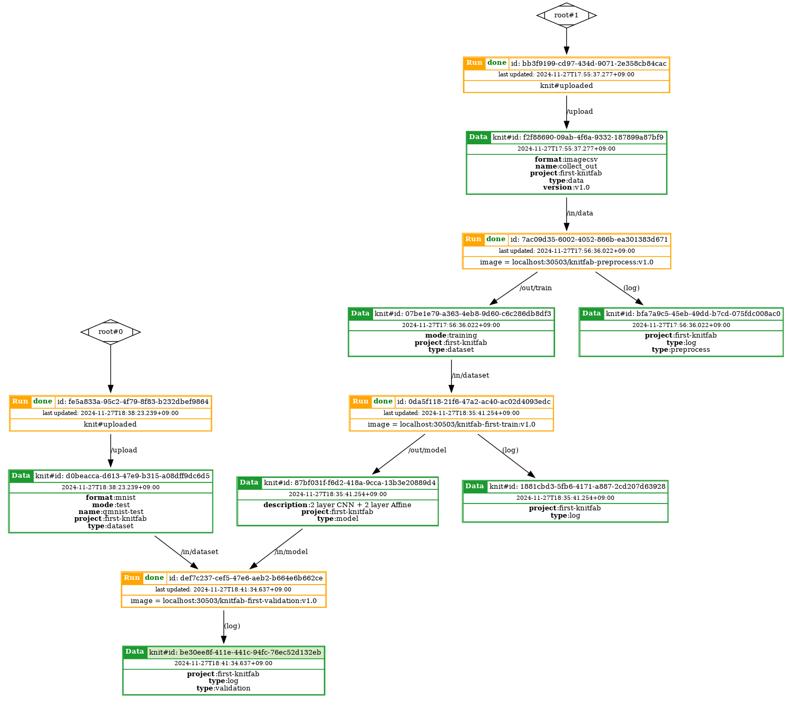
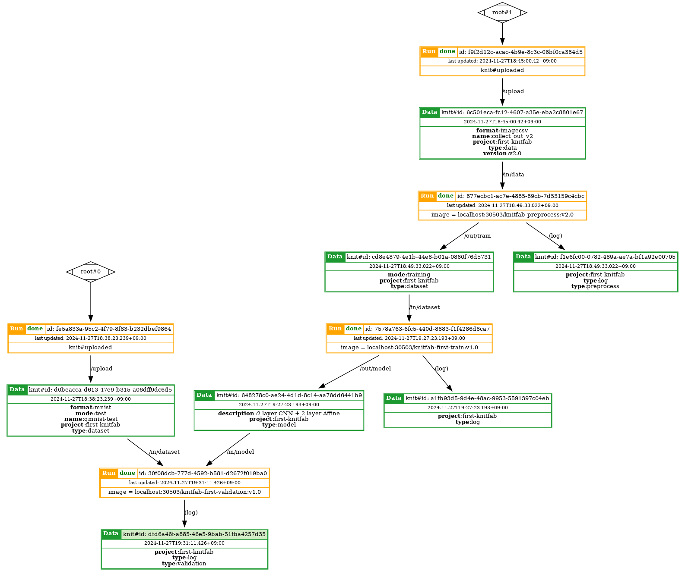

# Knitfabでデータ変更に対応できるワークフローを作成する

データの加工を行うKnitfabのplanを作成し、加工・訓練・評価の一連のタスクを実行するワークフローを作成します。
また、データ形式の変更と加工プログラムの改修を通して、Knitfabのワークフローの変更が一部分で済むことを確認します。

### まえがき

#### データマネジメントから見た機械学習プロジェクトの問題点（結合が密になりやすい）

データを基にそのデータのパターンや別のデータへの変換などを学習する機械学習では、
機械学習プログラムが入力データを直接参照しているため、データとプログラムの結合が密になる傾向があります。

結合が密になっていると、一方が他方に大きな影響を与え、改修の対応が難しくなります。
例えば、データのスキーマの変更によりプログラムの修正が必要になることや、他プロジェクトで作成したプログラムが目的のデータにそのまま適用できないなどの問題が考えられます。
そのため、結合が密になっている状態では、データのスキーマの変更に伴う対応や、プログラムの再利用が難しくなります。

#### 加工処理を作成し、疎結合の方向に動かす

結合を少しでも疎にするために、源泉となるデータを機械学習プログラムが使用できる形式に加工する処理を作成することが考えられます。
加工プログラムを作成すると、源泉データが変更された際に機械学習プログラムのかわりに加工プログラムを変更することで、データの変更を吸収できます。
さらに複数の機械学習プログラムが共通のデータを入力としていた場合、ひとつの加工プログラムの変更のみで解決します。

#### Knitfabのタグベースワークフロー

加工や訓練などの一連のタスクをワークフローとして実行するプログラムは、Apache AirflowやAWS Step Functionsなどがありますが、
これらはタスク同士のつながりを直接定義して作成します。
一方、このチュートリアルで用いるKnitfabは、データに付けられたタグにより実行を管理するタグベースのワークフローの機能を有しています。

実行管理をタグベースにすることによって、ワークフロー全体をコピーするのではなく、タグに合致する新たなタスクを作成することで、
既存の処理を残したままワークフローを部分的に修正できる特徴があります。
つまり、データのバージョンを更新した際に、更新前と更新後の両方のデータに対応できる利点があります。

#### チュートリアルの流れ

このチュートリアルでは、データの変更に対応できる機械学習のワークフローの作成を題材に、下記の流れで説明します。

1. 源泉となるデータを収集するサーバプログラムを作成してデータを収集
2. データを機械学習に入力できる形式に変換する加工処理を作成
3. 加工処理をKnitfabで実行すると、後続の訓練、評価まで逐次実行されることを確認
4. データスキーマの変更に合わせて、加工処理を更新することで、新たなデータ形式に対応できることを確認

#### 前提

Knitfabの[Getting started](https://knitfab.opst.co.jp/getting-started)を実施し、下記コマンドの実行によりplanの登録が確認できることが前提です。

```bash
knit plan find --in-tag "project:first-knitfab" --in-tag "type:dataset" --in-tag "mode:training"
knit plan find --in-tag "project:first-knitfab" --in-tag "type:dataset" --in-tag "mode:validation"
```


### チュートリアル

チュートリアルは下記の流れで進みます。

1. 源泉となるデータを収集するサーバプログラムを作成してデータを収集
2. データを機械学習に入力できる形式に変換する加工処理を作成
3. 加工処理をKnitfabで実行すると、後続の訓練、評価まで逐次実行されることを確認
4. さらに、データスキーマの変更に合わせて、加工処理を更新することで、新たなデータ形式に対応できることを確認

前提となっているチュートリアルでは、`qmnist`を入力として手書き文字を識別していたので、
このチュートリアルは、その`qmnist`と同じ形式のデータを作成するための加工処理planを作成します。

#### 源泉データ作成

チュートリアルで作成するデータ形式は、手書き文字認識のタスクに合わせて、手書き文字の画像と画像のid・数字のペアが1行で記載された下記のcsvファイルを用意します。

```
070,0
081,1
093,3
006,6
027,7
```

この箇所は、後の部分で使用するサンプルデータの作成方法に関する部分で、チュートリアルとして必須ではありません。スキップする場合は`collect_out`の内容をダウンロードし、[加工プログラムv1の作成](#加工プログラムv1の作成)に進んでください。

##### プログラムの概要、動作方法、注意

データ収集用プログラムは`collect`に作成しました。このプログラムは、下記の2つの処理から構成されます。

1. (画像表示) 下記を含むHTMLレスポンスを作成します。
    1. 画像idをランダムに選択して、form入力にhiddenで記載
    2. 選択されたidの画像データをimgタグのurlに埋め込みで記載
    3. 画像のラベルを入力するテキスト入力
    4. 送信ボタン

2. (データ作成) 受け取ったフォームの入力内容から、画像idとラベルをローカルのcsvファイルに追記します。

なお、バリデーションや出力のエスケープを行わないので、外部に公開せず、あくまでチュートリアルの目的で使用してください。



##### サーバの起動、データ収集

このサーバをdockerで実行するには、下記コマンドでイメージを作成し、コンテナを実行します。

```bash
docker build -t knitfab-collect:v1.0 -f ./collect/Dockerfile ./collect
docker run --rm -d -p 5050:5000 -e OUT_PATH=/data.csv --name knitfab-collect knitfab-collect:v1.0
```

`Dockerfile`があるディレクトリと同じディレクトリに、画像ファイルが格納された`assets`を用意します。
チュートリアル用途で、手書き文字の画像を用意しているため、このチュートリアルのリポジトリをcloneした場合はすでに準備できています。

コンテナを起動して、クライアントからブラウザで接続(`localhost:5050`)すると、画像とテキスト入力が表示されるので、数字を入力して、送信ボタンを押下して送信します。
データが追記されたあと、リダイレクトで元の画面に戻り再度画像とフィールドが表示されるので、入力を繰り返します。
表示、送信を何度か実行したあと、下記でdockerコンテナ内からローカルに転送します。

```bash
docker container cp knitfab-collect:/data.csv ./collect_out/data.csv
```

コンテナを停止するには、`docker stop`を実行します。

```bash
docker stop knitfab-collect
```

画像と数字のcsvファイルが作成できたので、次に作成する加工プログラムで`qmnist`と同じデータ形式に変換します。


#### 加工プログラムv1の作成

作成(ダウンロード)したデータを加工して、訓練、評価に使用できるようにする加工プログラムを作成します。
プログラムは`preprocess`ディレクトリに格納されています。下記の手順により入力のデータを`qmnist`と同じデータ形式に変換します。

1. すべての画像を読み込み、サイズを`28x28`に縮小する
2. `uint8`型の`numpy`の`array`に変換し、`255`から引くことで色を逆にする
3. csvファイルを読み込み画像idに対応する画像とラベルを紐づけする
4. 訓練プログラムはデータが60,000サンプルあることが前提なので、同じデータで60,000サンプルにかさ増しする
5. 画像データとラベルデータをそれぞれgzip形式に圧縮して出力ディレクトリに書き出す

下記コマンドでイメージを作成します。

```bash
docker build -t knitfab-preprocess:v1.0 -f ./preprocess/Dockerfile ./preprocess
```

`docker run`で動作確認します。

```bash
docker run --rm -it \
    -v "$(pwd)/collect_out:/in/data" \
    -v "$(pwd)/data/custom-train:/out/train" \
    knitfab-preprocess:v1.0
```

さらに後続の訓練が実行できることを確認します。

```bash
docker run --rm -it \
    -v "$(pwd)/data/custom-train:/in/dataset" \
    -v "$(pwd)/out/model-custom:/out/model" \
    knitfab-first-train:v1.0
```

`knitfab-first-train:v1.0`はKnitfabのGetting startedで作成した訓練用コンテナのタグです。

訓練の実行が確認できたら、下記コマンドでコンテナをregistryに登録し、planの作成を行います。

```bash
docker tag knitfab-preprocess:v1.0 ${YOUR_KNITFAB_NODE}:${PORT}/knitfab-preprocess:v1.0
docker push ${YOUR_KNITFAB_NODE}:${PORT}/knitfab-preprocess:v1.0
```

planのテンプレートをコンテナの内容から作成します。

```bash
docker save ${YOUR_KNITFAB_NODE}:${PORT}/knitfab-preprocess:v1.0 | ./knit plan template > ./knitfab-preprocess.v1.0.plan.yaml
```

出力されたテンプレートを編集します。
`inputs`では特定バージョンのデータのみを取り込むように指定しておきます。
`outputs`では後続の訓練planが実行するようにタグを設定します。

```yaml
image: "localhost:${PORT}/knitfab-preprocess:v1.0"

inputs:
  - path: "/in/data"
    tags:
      - "type:data"
      - "project:first-knitfab"
      - "format:imagecsv"
      - "version:v1.0"

outputs:
  - path: "/out/train"
    tags:
      - "type:dataset"
      - "project:first-knitfab"
      - "mode:training"
```

planのテンプレートを編集したあと、planを登録します。

```bash
knit plan apply ./knitfab-preprocess.v1.0.plan.yaml
```

#### データの登録、訓練、評価の実行

planの登録が完了したあとは、源泉データをアップロードして、加工、訓練、評価の順にrunされることを確認します。
このとき、データのバージョンを表すタグを設定し、バージョンを明示します。

```bash
knit data push -t format:imagecsv -t type:data -t version:v1.0 -t project:first-knitfab -n ./collect_out
```

評価まで実行された後に、評価データから上流の方向にrunを表示すると、下記の図になります。



ここで、データおよび加工のバージョンタグが適切に設定されていることを確認します。

#### データスキーマ更新時の作業、加工プログラムv2の作成

源泉データの形式が更新されたことを想定して、新たな加工planを作成し、更新後のデータを登録して評価まで実行されることを確認します。
このチュートリアルでは、csvファイルの各行の先頭に`,`を挿入してcsvファイルの列の位置を変えることでスキーマの変更とします。
変更後のデータを`collect_out_v2`ディレクトリに格納しています。

加工planの更新については、更新後のデータ形式に対応できるように、行のフォーマットを変更しました。
`preprocess_v2`ディレクトリに改修後のスクリプトを格納しています。

これまでと同様、下記のコマンドでイメージの作成、registryへのアップロードを行います。

```bash
docker build -t knitfab-preprocess:v2.0 -f ./preprocess_v2/Dockerfile ./preprocess_v2
docker tag knitfab-preprocess:v2.0 ${YOUR_KNITFAB_NODE}:${PORT}/knitfab-preprocess:v2.0
docker push ${YOUR_KNITFAB_NODE}:${PORT}/knitfab-preprocess:v2.0
```

ここでコンテナが変更後のデータ形式に対応するか確認しておきます。

```bash
docker run --rm -it \
    -v "$(pwd)/collect_out_v2:/in/data" \
    -v "$(pwd)/data/custom-train-v2:/out/train" \
    knitfab-preprocess:v2.0
```

さらに後続の訓練が実行できることを確認します。

```bash
docker run --rm -it \
    -v "$(pwd)/data/custom-train-v2:/in/dataset" \
    -v "$(pwd)/out/model-custom-v2:/out/model" \
    knitfab-first-train:v1.0
```

訓練用のコンテナが動作することを確認したあと、加工用のKnitfab planのテンプレートをコピーして、バージョン、対象のコンテナを変更します。

```yaml
image: "localhost:30503/knitfab-preprocess:v2.0"

inputs:
  - path: "/in/data"
    tags:
      - "type:data"
      - "project:first-knitfab"
      - "format:imagecsv"
      - "version:v2.0"

outputs:
  - path: "/out/train"
    tags:
      - "type:dataset"
      - "project:first-knitfab"
      - "mode:training"
```

planを登録します。

```bash
knit plan apply ./knitfab-preprocess.v2.0.plan.yaml
```

データ登録、その後、評価まで自動実行されることを確認します。
この際、バージョンを指定して、適切な加工プログラムが実行されるようにします。

```bash
knit data push -t format:imagecsv -t type:data -t version:v2.0 -t project:first-knitfab -n ./collect_out_v2
```

評価まで実行された後に、評価データから上流の方向にrunを表示すると、下記の図になります。



また、リネージから旧バージョンのデータを使用して新バージョンの加工が実行されていないことが確認できます。
Knitfabでは、タグに基づいて実行を管理するため、バージョンタグが一致しないplanは実行が抑止されます。
また、ワークフローに処理を追加することでワークフローを部分的に改修できるため、データ変更前の機能も保持される特徴があります。

加工処理を使用しなかった場合、データの変更に対して訓練と評価の2つのプログラムを変更する必要があるため、
加工処理の使用は再利用の観点では有効と考えられます。
しかし、実際は、データのスキーマが変更されると、評価の基準が変わることが考えられるので、評価用スクリプトは新たに書く必要があるかもしれません。

### むすび

このチュートリアルでは、データの加工用のKnitfab planを作成し、データ変更に対応できるワークフローを作成しました。
Knitfabを使うと、タグに基づくplanの実行管理により、バージョンが異なるデータに対する望まない実行を抑止する効果があります。
また、ワークフローに処理を追加することでワークフローを部分的に改修できるため、データ変更前の処理も保持される特徴があります。
